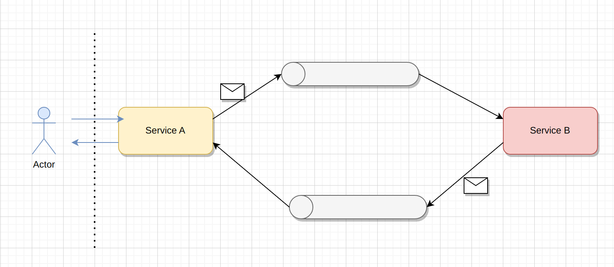

# Command Request / Response

One of the interaction styles using messaging in a microservices environment is Synchronous Request / Response, which is
required when the client is waiting for an immediate response.

In this case, a message type called 'Command' is used.

A 'Message Command' is a message that defines an operation with its parameters. So we can think of a Command Synchronous
Request Response as a function of an imperative language, where the name of the function is the name of the topic, the
arguments are the parameters included in the message body, we can execute the function and the next line of code will
have the result of these operation.



The problem with this approach (in this environment) is that everything is asynchronous, and we need an immediate
response to continue with the execution. Therefore, we have two critical points:

- Sending messages with Kafka which was implemented to be asynchronous, when the message is sent the executions continue
  without waiting for the response.
- Processing the response, we have to think that we have some replica pods, so the message response can be received by
  any pod.
  

### Disclaimer!

You might be tempted to implement this operation as an API request/response skipping the message bus. You might think
that this is faster to implement than a bus communication and you do not have time, this is a typical justification for
almost wrong decisions. I wonder if you are thinking about performance, availability or scalability, I ask you to take
the time to think about a good design thinking in terms of the performance of your system, rather than the faster way.
Bad design decisions are hard to correct in the future.


# How implement Command Request / Response with Kafka ?

## Context

Imagine a system where we have a front-end and a back-end and we are applying a microservices architecture pattern, it
is used a bus for the communication between different applications with their pod replica.
For the communication bus, it would use Kafka and for the back-end microservices it would use Spring-Boot.

## A solution

I have been reading and thinking about this issue and I have found two possible solutions:

One of them consists of having two topics and uses the redis to keep the information of the operation, one for the
request message command and the other for the response. The Server A sends the message topic, adds on the Redis
operation data and locked the thread. When the Server B reads the message and write the response on the other topic.
Finally one instance of the Server A reads the response and updates data operation in the Redis. Then the thread of the
Server A unlocked and completed the action.


On the other hand, a different approach less sophisticated is to dispatch a message command with a header that contains
the specific topic where Service B must respond. In this topic only the instance locked of Service A is listening.
After that, Service A is locked, waiting for an answer while any replica of Service B responds.
Then the specific version of Service A consumes the message, and unlocks the thread, we used shared memory to pass the
response to the requesting thread.


As you can see in this repository I have chose to implement the Seconds approach, next diagram shows a details sequence
of the operations.

Although sometimes is necessary, this approach presents significant drawbacks, such as reduce availability, scalability
and flexibility, so you should be careful.

## How to test

This repo contains a docker-compose to test the solution. To deploy it, just run: docker-compose up and
they will be deployed two request services (8080/8081) with two response services (8082/8083), a zookeeper and a kafka
service (9092).


Deploying

```
$ docker-compose up
```


To check each service:

```
$ curl http://localhost:8080/
> server.request.1: I'm ready!
```

To execute a command:

```
$ curl http://localhost:8080/command
> ConsumerRecord(topic = topic.server.request.1, partition = 0, headers = ...), 
RecordHeader(value = server.response.1: pong)
```

The response is a consumer record which contains all the data that you need to check who is responding and who is
reading.

Finally, we will see how this solution can be more available than other classical solutions. If you stop the 'response
server' that is responding, you will notice that the other 'response server' is responding.
it. So here we have a typical example of the resiliency and availability that every microservice environment must have.

```
$ docker-compose stop response.service.1
$ curl http://localhost:8080/command
> ConsumerRecord(topic = topic.server.request.1, partition = 0, headers = ...), 
RecordHeader(value = server.response.2: pong)
```
